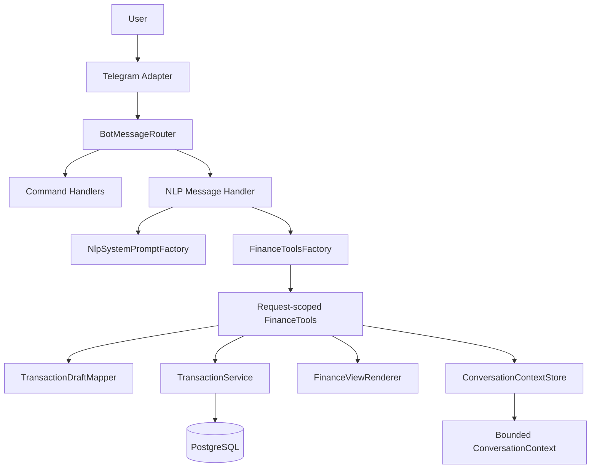
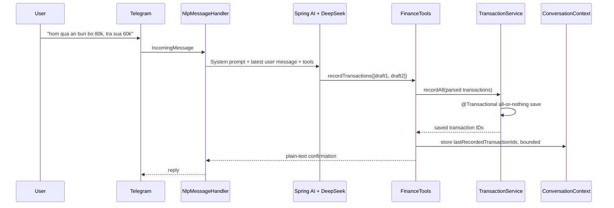
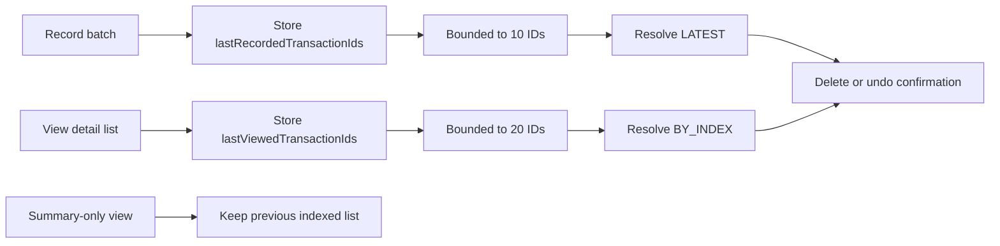
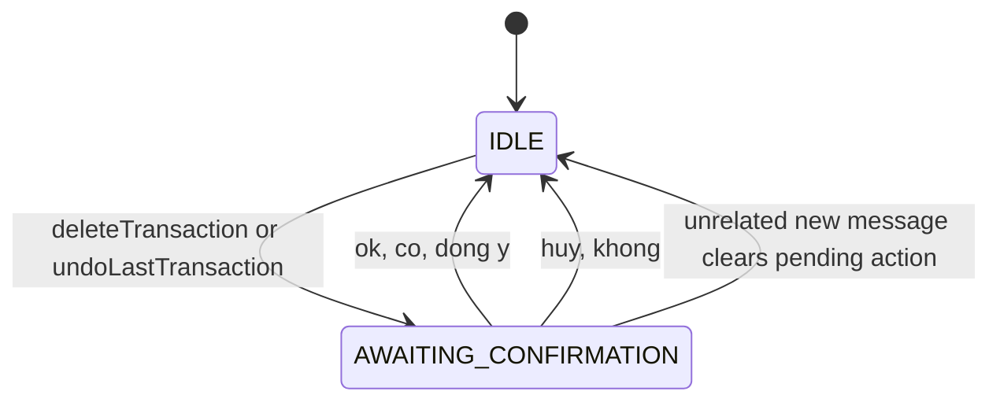

# IOM Technical Case Study

> IOM is a personal finance assistant that turns natural-language chat messages into structured
> income and expense records. The project is intentionally scoped as a portfolio-grade engineering
> case study, not a production fintech product.

## 1. Positioning

IOM focuses on a practical problem: recording small daily expenses is tedious, especially on mobile.
Instead of forcing users through forms, the assistant accepts messages such as:

```text
hom qua an bun bo 80k, tra sua 60k
```

The system parses the message through Spring AI tool calling, records multiple transactions
atomically, keeps a minimal bounded conversation context, and renders plain-text replies that can be
reused across Telegram, web, and future channels.

## 2. Architecture Overview



Key design choice: the LLM does not write directly to the database. It can only select typed tools.
The application owns validation, mapping, transactions, confirmation, and rendering.

## 3. NLP Tool-Calling Flow



Why this matters:

- Multi-transaction input is handled as one batch.
- Invalid batch input does not partially persist.
- The prompt is only an intent router. Domain rules live in Java.
- Output is platform-neutral plain text.

## 4. Context Strategy



The conversation context stores IDs only. It avoids long message history, transaction snapshots, or
rendered text. When details are needed, the service queries the database by ID.

This keeps token usage predictable and reduces privacy exposure while still supporting follow-up
commands such as:

```text
xoa cai moi ghi
xoa so 2
undo
```

## 5. Safety Boundary For Destructive Actions



Deletion and undo are two-step operations. The LLM can start a pending action, but the actual delete
requires a short user confirmation handled outside the LLM path.

The prompt also treats user text, transaction notes, copied text, and quoted messages as untrusted
data, so instructions embedded inside notes cannot change system or tool rules.

## 6. Domain And Persistence Flow

```mermaid
flowchart TD
    D[TransactionDraft] --> MP[MapStruct Mapper]
    MP --> P[ParsedTransaction]
    P --> TS[TransactionService]
    TS --> E[Transaction Entity]
    E --> R[TransactionRepository]
    R --> DB[(PostgreSQL)]

    TS -->|recordAll| TX1[@Transactional save batch]
    TS -->|deleteAll| TX2[@Transactional delete batch]
```

The service layer owns transaction boundaries:

- `recordAll(...)` records a batch atomically.
- `deleteAll(...)` validates ownership and existence before deleting a confirmed batch.
- The domain model remains independent from Telegram and Spring AI concerns.

## 7. Engineering Highlights

- Spring Boot backend with hexagonal-style boundaries.
- Spring AI tool calling for structured NLP actions.
- Request-scoped finance tools bound to the resolved user and conversation.
- Batch transaction recording with all-or-nothing persistence.
- Bounded context by IDs instead of long chat memory.
- Confirmation guard for destructive actions.
- Platform-neutral reply rendering for Telegram and future web clients.
- Focused unit tests across NLP tools, context, renderer, service, and domain behavior.

## 8. Production Boundaries

This is a personal portfolio project. The following are intentionally framed as future hardening
work rather than completed claims:

- Persistent distributed conversation context instead of in-memory context.
- Rate limiting and abuse protection.
- Provider failover and LLM usage-cost telemetry.
- Stronger auth and user data export/delete flows.
- Observability dashboard with request traces and token usage metrics.
- End-to-end deployment pipeline with staging and production environments.

## 9. Suggested CV Version

```text
AI Personal Finance Assistant
- Built a Spring Boot personal finance assistant with Telegram integration and Spring AI
  tool-calling for natural-language transaction recording, summaries, deletion, and undo flows.
- Designed bounded conversation context and confirmation guards to reduce token usage and prevent
  accidental destructive actions.
- Implemented batch transaction recording with all-or-nothing persistence, MapStruct DTO mapping,
  and focused unit tests across NLP tools, services, renderers, and domain logic.
```

